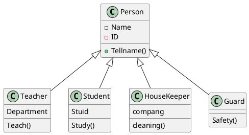

# HOMEWORK 12/21/2023

```plantuml   
@startuml
class  Person{
-Name
-ID
+Tellname()
}
class Teacher{
Department
Teach()
}
class Student{
Stuid
Study()
}
class HouseKeeper{
compang
cleaning()
}
class Guard{
Safety()
}
Person <|-- Teacher
Person <|-- Student
Person <|-- HouseKeeper
Person <|-- Guard
@enduml
```

